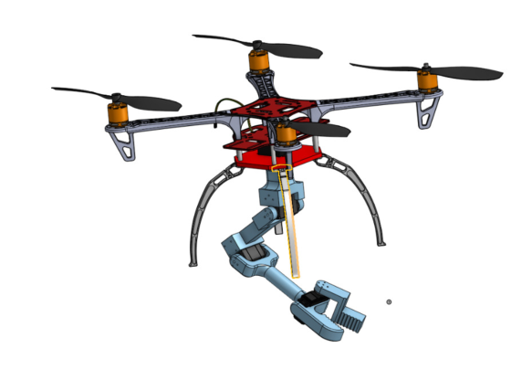
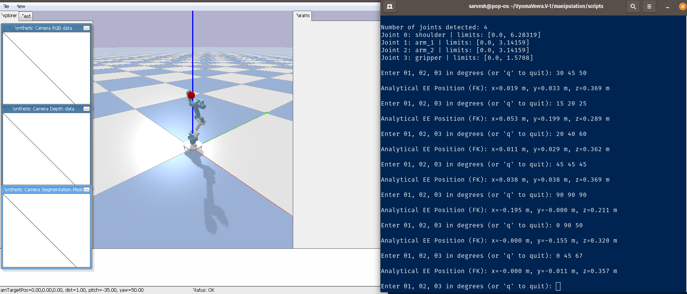
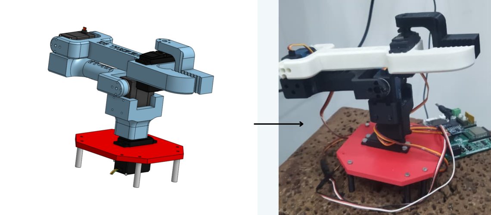

# VyomaVeera.V-1

## WHAT IS AN AERIAL MANIPULATOR:
The term Aerial Manipulator often leads to confusion. In simple terms, it refers to an Unmanned Aerial Vehicle (UAV) equipped with manipulation capabilities.
These capabilities may arise either from:

* an integrated manipulation mechanism, or

* a robotic manipulator rigidly attached to the UAV base.

VyomaVeera V-1 is a first-principles-designed, 3-degree-of-freedom aerial manipulator that integrates a multirotor UAV with a 3-DoF serial robotic manipulator.
The project is aimed at research in aerial manipulation, control, autonomy, and learning-based methods.

Below is the first design iteration of the Aerial Manipulator.

  

The standard X450 quadrotor frame is used as the base platform for the manipulator.
The complete CAD model has been designed and iterated using OnShape.

As mentioned earlier, the current manipulator has three degrees of freedom, and its design is inspired by the SO-100 manipulator architecture.

Next phase of the project after completing the CAD design  was the simulation. We converted the CAD model of the drone and the manipulator separately using `onshape-to-robot` and verified the model on PyBullet. 

#### WHY SEPERATELY SIMULATE BOTH MODELS:
Since aerial manipulation is a tight coupling of flight dynamics and manipulation dynamics, it is essential to:

understand each subsystem independently, and

build a fundamentally correct working model before integration.

To follow this approach, the project is currently divided into three parallel development parts.

## 1. SIMULATION OF MANIPULATOR
The initial step involved solving the forward kinematics of the manipulator while accounting for all current dimensions and joint constraints.

To validate the analytical forward kinematics model, the manipulator was simulated in PyBullet.

  

Results:
The forward kinematics model was validated after minor refinements to the equations.
The predicted end-effector position was marked using a PyBullet marker and compared against the simulated manipulator motion, confirming accurate behavior.

Following this validation, the current work focuses on ROS 2 integration for manipulator control.

## 2. REDESIGN OF THE MANIPULATOR

  

After the initial design, the manipulator was 3D-printed and assembled, which helped identify several potential improvements.
These include replacing the current RDS3225 motor, and exploring the use of dual-shaft smart servos for improved alignment and torque handling.

Based on these observations, the manipulator design will be iterated and improved.

## 3. SIMULATION OF CUSTOM DRONE MODEL

Using PX4 Autopilot, the custom drone model was successfully loaded into Gazebo.
The current focus is on achieving stable flight performance with the custom airframe.

The detailed procedure for loading and simulating the custom drone model is documented [here](ttps://github.com/SKYBIRDSGP/VyomaVeera.V-1/blob/dev_sarvesh/Custom_Robot.md).

## CURRENT/NEXT TASKS:

1. ROS2 Integration for Forward Kinematics based Teleoperation of the Manipulator.
2. PX4 simulation of the custom drone model.
3. Implementation of flight maneuvers on the drone.
4. Iteration of Vyomaveera V-2.
5. Integration of Drone and Manipulator.

